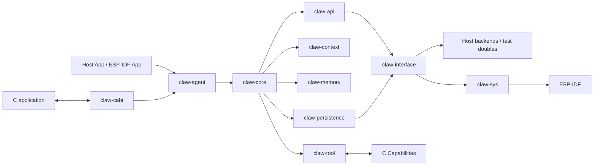

# Claw Agent Framework

[](rust-toolchain.toml)
[](docs/installation.md)
[](docs/development/testing.md)
[](../LICENSE)

Claw Agent Framework 是 ESP-Claw 的 Rust Agent Runtime。它负责 LLM 调用、Session、Tool、Memory、Skill、Permission、Persistence 与多 Agent 编排，并通过 C ABI 嵌入 ESP-IDF 固件。

这个目录既可以作为 Host 上可测试的 Rust workspace 使用，也可以构建成 `libclaw_cabi.a`，由 ESP-Claw 固件链接。设备驱动、Lua、Event Router、IM 和既有 C Capabilities 仍保留在仓库其他目录中。

> 如果你只是想烧录和使用 ESP-Claw 设备，请从[项目首页](../README_CN.md)或[用户文档站](https://esp-claw.com/zh-cn/)开始。本文档面向 Framework 使用者、嵌入者和贡献者。

## 这是什么

Framework 将 Agent 业务逻辑和平台实现分开：

- `claw-agent` 提供公开的 `AgentSystem` 装配入口。
- `claw-core` 驱动 Session、Turn、Iteration、Tool loop 与 multiagent。
- `claw-api` 统一 OpenAI-compatible 与 Anthropic-compatible LLM API。
- `claw-interface` 定义文件系统、HTTP、线程、执行器和 Timer 接口。
- `claw-sys` 实现 ESP-IDF 平台适配。
- `claw-cabi` 通过 [`claw_agent.h`](crates/claw-cabi/include/claw_agent.h) 向 C 暴露 Runtime。



详细设计见[架构总览](docs/architecture/overview.md)。

## 核心能力

- 长期 Session event stream，显式区分 Turn、Iteration、Reasoning、Output 和 Tool result。
- persistent/ephemeral Session，以及 interrupt、cancel、append 和 input response。
- OpenAI-compatible、Anthropic-compatible、SSE、结构化 JSON 与图片推理。
- Tool registry、按组发现和加载、同步/异步/detached Tool。
- `Allow` / `Ask` / `Deny` 权限策略与人工批准回路。
- Transcript、Profile、Long-term Memory 和 LLM compaction。
- 多根 Skill 扫描，DATA root 优先覆盖 SYSTEM root。
- Typed persistence、schema version 和 checkpoint recovery。
- Multiagent spawn、follow-up、watch、interrupt、delete 与前后台执行。
- Host test doubles、ESP-IDF backend、C ABI 和多芯片静态库。
- Structured tracing、Chrome/Perfetto 导出、Context observer 与 LLM tape replay。

## 支持范围

| 项目 | 当前支持 |
| --- | --- |
| Host Rust | stable；CI 当前使用 Rust 1.96.0 |
| ESP-IDF | 仅 v6.1.x；已验证 `release/v6.1` @ `3e24f276` |
| 设备目标 | `esp32s3`、`esp32c5`、`esp32p4`、`esp32s31` |
| LLM API | OpenAI-compatible、Anthropic-compatible |
| 固件集成 | ESP-IDF component + C ABI + per-target static archive |
| Host CI | Linux |
| License | Apache-2.0 |

当前分支处于 Rust Runtime 集成阶段。公开 API 通过 snapshots 守护，但 crate 版本仍为 `0.1.0`，合入破坏性改动前必须明确更新 snapshot 和迁移说明。项目尚未发布自动化 coverage 报告，因此 README 不展示虚假的 coverage badge。

## Quick Start：5 分钟跑通

### 1. 准备 Host 环境

安装 Rust stable，然后进入本目录：

```bash
rustup toolchain install stable
rustup component add rustfmt clippy
cd agent-framework
```

完整依赖见[安装指南](docs/installation.md)。

### 2. 运行离线 Agent 示例

下面的示例使用内存文件系统和 scripted LLM，不访问网络，也不需要 API key：

```bash
cargo run -p claw-agent --example tool_submit_loop \
  --target x86_64-unknown-linux-gnu
```

成功时会看到 Tool 注册、Session 事件和一条本地模拟的 Agent 输出：

```text
registered tool `time_now`
session `session-1` events:
  > Hello from the agent ...
```

### 3. 跑基础检查

```bash
cargo test --workspace --all-targets
```

到这里已经验证 Rust workspace、AgentSystem、Session stream 与 Host backend 能工作。更多示例见[示例目录](docs/examples.md)。

## 连接真实模型

Host CLI 会把持久化数据写到 `crates/claw-cli/output/claw-agent-chat/`：

```bash
cp crates/claw-cli/.env.example crates/claw-cli/.env.local
```

编辑 `.env.local`：

```dotenv
CLAW_LLM_API_KEY=your-key
CLAW_LLM_BASE_URL=https://api.openai.com/v1
CLAW_LLM_MODEL=your-model
```

启动：

```bash
cargo run -p claw-cli --bin claw-agent-chat
```

CLI 支持 `/append`、`/interrupt`、`/cancel`、`/session`、`/permissions` 和 `/reasoning_effort`。操作方式见[用户指南](docs/user-guide.md)。

## 构建 ESP-IDF 固件

仓库已提交四个目标的 zstd 压缩静态库。只构建普通固件时，不需要 Rust toolchain，但需要 ESP-IDF v6.1、Board Manager helper 和 `zstd`：

```bash
cd ../application/edge_agent
idf.py bmgr -c ./boards -b esp32_S3_DevKitC_1
idf.py build
```

修改 Rust 源码后，先安装 Espressif Rust toolchain，再重新生成 archive：

```bash
cd ../../agent-framework
./build-idf-staticlib.sh
./build-idf-staticlib.sh --check
```

构建路径、工具链和 archive 规则见[构建系统](docs/development/build-system.md)。

## 如何使用

根据你的角色选择入口：

| 目标 | 从这里开始 |
| --- | --- |
| 快速验证 Framework | [Getting Started](docs/getting-started.md) |
| 使用 Host CLI | [用户指南](docs/user-guide.md) |
| 嵌入 Rust 应用 | [Rust API](docs/api/rust-api.md) |
| 从 ESP-IDF C 调用 | [C API](docs/api/c-api.md) |
| 配置 feature、环境变量或 CMake | [配置参考](docs/configuration.md) |
| 查找可运行样例 | [Examples](docs/examples.md) |
| 解决构建或运行问题 | [Troubleshooting](docs/troubleshooting.md) |
| 修改源码 | [开发指南](docs/development/development-guide.md) |
| 理解设计原因 | [架构文档](docs/architecture/overview.md)与 [ADR](docs/adr/README.md) |

完整索引见 [`docs/README.md`](docs/README.md)。ESP-Claw 产品级用户文档仍维护在仓库根部 `docs/`，并保持中英文同步。

## 项目结构

```text
agent-framework/
├── crates/                 # 生产 Rust crates
├── c-legacy/               # 过渡期 C adapter
├── bench/                  # profiling 与 LLM tape
├── cmake/                  # ESP-IDF/Rust target 解析
├── docs/                   # Framework 使用、开发与架构文档
├── snapshots/              # cargo-public-api 快照
├── CMakeLists.txt          # ESP-IDF component 与 staticlib 链接
├── Cargo.toml              # Rust workspace 与 release profile
├── check.sh                # 基础检查 + public API 守护
├── harness.sh              # fmt/clippy/check/test feature matrix
└── build-idf-staticlib.sh  # 构建或验证设备 archive
```

每个 crate 的职责和允许的依赖方向见[代码结构](docs/development/code-structure.md)。

## 开发与验证

日常 Rust 改动至少运行：

```bash
./check.sh
./harness.sh
```

如果公开 API 是有意变化：

```bash
./update-public-api-snapshots.sh
git diff -- snapshots/
```

如果 Rust 改动会进入固件：

```bash
./build-idf-staticlib.sh
./build-idf-staticlib.sh --check
```

不要手工修改 `.a.zst`。完整测试矩阵和何时运行设备测试见[测试指南](docs/development/testing.md)。

## 出了问题怎么办

先查看[Troubleshooting](docs/troubleshooting.md)。提交问题时至少附上：

- Host OS、Rust/ESP-IDF 版本和目标芯片。
- 完整命令与第一处错误，不要只贴最后一行。
- 是否使用 committed archive，或 `CLAW_RUST_PREBUILT_DIR=` 源码构建。
- 使用的 feature，尤其是 `prod_logging`、`rich_logging`、`cache_profile`。
- 可复现步骤、最小输入，以及删去密钥后的日志或 trace。

不要提交 API key、Wi-Fi 密码、IM token、完整私有模型响应或未经脱敏的 LLM tape。

## 如何贡献

请先阅读 [`CONTRIBUTING.md`](CONTRIBUTING.md)。一个可合入的修改应做到：

- 职责放在正确 crate，不跨越平台与领域边界。
- production 路径保留 typed error source，不用字符串吞掉错误。
- 不在 `.await` 期间持有共享状态锁。
- 新增或变更公开 API 时同步 rustdoc、snapshot、示例和迁移说明。
- 根据改动范围运行 Host、设备、文档和 archive 校验。

## Roadmap 与迁移记录

- 当前 Roadmap：[`roadmap.md`](roadmap.md)
- Rust 迁移变更记录：[`rust-migration-summary.md`](rust-migration-summary.md)
- 关键架构决策：[`docs/adr/`](docs/adr/README.md)

## License

本项目使用 [Apache License 2.0](../LICENSE)。
