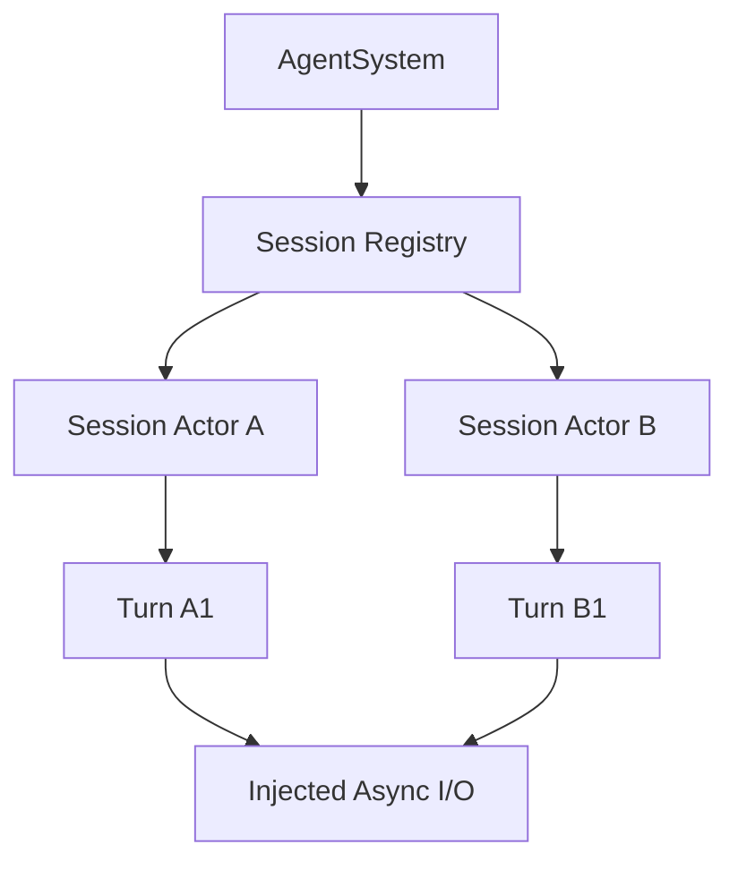

# 并发模型

框架采用“会话拥有可变状态、通过消息驱动”的模型。目标不是最大化线程数量，而是在受限设备上保持顺序明确、可取消、易于测试。

## 所有权层次



- `AgentSystem` 拥有运行时级资源和会话注册表；
- 每个 Session actor 串行拥有该会话的可变状态；
- 每次 Turn 是会话内的一段工作，而不是新的会话；
- 网络、存储和工具执行通过异步端口等待结果；
- 事件消费者与会话之间通过有界或受控通道解耦。

## 调度原则

设备侧可在单个 OS 工作线程上运行协作式异步任务。任务只有在 `.await` 或显式让出时才给其他任务执行机会，因此：

- 长 CPU 计算必须分段或移到受控执行器；
- 不允许在异步任务内做无界阻塞 I/O；
- 不跨 `.await` 持有 `std::sync::Mutex` 等阻塞锁；
- 能由一个 actor 独占的数据，不为了方便而包装成全局 `Arc<Mutex<_>>`；
- 跨线程共享确有必要时，必须记录锁顺序、临界区和回调上下文。

## 会话内顺序

一个会话内的状态变化保持顺序一致：

```text
输入排队 -> 构建 Turn -> 模型/工具循环 -> 提交记忆 -> TurnEnded
```

`append` 可以为当前会话追加输入；`respond` 用于回应等待中的交互；`interrupt` 请求当前 Turn 尽快停止；`cancel` 取消待处理或当前工作。具体效果取决于当前等待点，均为协作式操作，不应被描述为强制终止线程。

## 跨会话并发

不同会话可以交错推进，但必须受全局资源预算约束，例如：

- 同时进行的 LLM 请求数；
- 同时执行的工具数；
- 事件队列容量；
- 单会话历史与输出缓存；
- 每个 Turn 的工具调用轮数和总时长。

资源限制到达时，应返回可分类的忙碌、超时或容量错误，或施加明确背压；不能无限增长队列。

## 工具并发

模型一次可能产生多个工具调用。只有在以下条件同时成立时才适合并发执行：

- 调用之间无顺序依赖；
- 权限策略分别通过；
- 工具实现声明为可并发；
- 平台资源预算允许；
- 汇总结果时能恢复确定的调用对应关系。

具有副作用的工具默认应保守地串行处理。即使并发执行，返回给模型的结果也必须绑定原始 tool call ID。

## 事件泵与背压

每个打开的会话需要持续消费事件。如果上层停止读取，事件缓冲可能占满并阻塞生产者。集成方应：

1. 建立会话后立即启动事件泵；
2. 快速转发或复制必要字段，不在回调中执行长任务；
3. 对 C ABI 事件调用一次且仅一次释放函数；
4. 在 `TurnEnded` 后保留事件泵；
5. 在 `Closed` 或显式关闭后结束事件泵。

## 中断、超时和清理

取消信号需要向下传播到 LLM 请求、工具 future 和等待中的交互。实现应保证：

- 已申请的资源通过 RAII 或显式清理路径归还；
- 已提交的持久状态不会留下半写记录；
- 被取消的工具不会伪装成成功；
- 会话最终产生调用方可理解的边界事件；
- `Drop` 不依赖异步工作一定能够继续执行。

## 检查清单

修改并发代码时至少检查：

- 是否存在跨 `.await` 的锁 guard 或借用；
- 通道是否有容量和关闭语义；
- 发送端/接收端退出后，另一侧是否能结束；
- 取消发生在每个等待点时是否会泄漏资源；
- FFI 回调在哪个线程或任务上下文运行；
- 慢会话是否会饿死其他会话；
- 测试是否覆盖成功、超时、取消和接收端提前关闭。

