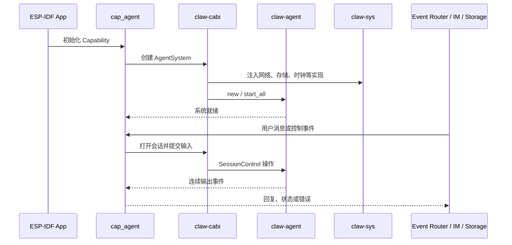
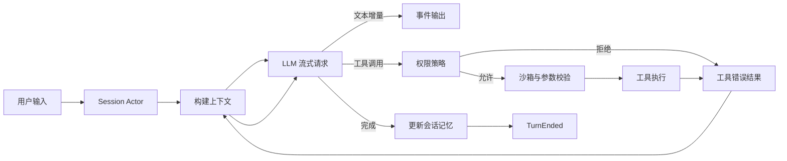
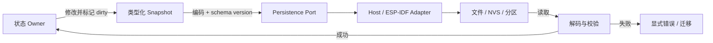

# 数据流

本文从控制面、单轮 Agent 执行和持久化三个角度说明数据如何穿过系统。

## 设备启动与控制面



`cap_agent` 是设备集成入口，负责把现有事件和配置转成 C ABI 调用。`claw-cabi` 负责验证输入并维护跨语言句柄；Agent 行为本身位于 Rust crate 中。

## 一次 Turn 的数据流



核心步骤如下：

1. 输入通过 `SessionControl` 排队到目标会话；
2. `claw-context` 组合系统提示、技能、历史和记忆；
3. `claw-api` 发送请求并把流式响应转换为类型化事件；
4. 文本增量立即向上游输出；
5. 工具请求先经过权限和资源边界检查，再交给工具组；
6. 工具结果被加入下一次模型请求，直到模型不再请求工具或触发限制；
7. Turn 的最终状态写入内存模型，并发出 `TurnEnded`。

工具循环必须有轮次、时间或资源限制，不能把模型产生的工具调用视为天然可信输入。

## 会话事件流

打开会话后，上层消费的是长生命周期事件流，而不是“一次请求对应一次连接”。典型顺序为：

```text
Started
-> OutputDelta ...
-> ToolStarted / ToolFinished ...
-> TurnEnded
-> （下一次输入）
-> OutputDelta ...
-> TurnEnded
-> Closed
```

`TurnEnded` 后会话仍可接受 `/append`、`respond` 或下一轮输入。只有 `Closed` 是事件流的终止条件。错误事件应携带可诊断信息，但调用方不能假设任意错误都自动销毁会话。

详见 [ADR-0003](../adr/0003-session-event-stream.md)。

## 配置数据流

配置可能来自编译期、设备配置、持久状态或运行时 API。推荐处理顺序是：

```text
编译期能力集合
    -> 平台默认值
        -> 持久化配置
            -> 本次进程的显式覆盖
```

每次覆盖都应先解析成类型化配置，再进入运行时。不要让环境变量、Kconfig 字符串或 JSON 字段直接散落到领域逻辑。

当前主机 CLI 的环境变量和设备构建选项见 [配置说明](../configuration.md)。

## 持久化数据流



状态 owner 决定何时生成快照；持久化层负责安全提交和恢复。损坏、版本不兼容和 I/O 失败必须保持可区分，不能统一解释成“没有数据”。

## 主机路径与设备路径

两条路径共享 Agent 领域逻辑，但适配器不同：

| 阶段 | 主机 | ESP-IDF 设备 |
| --- | --- | --- |
| 入口 | `claw-cli` 或 Rust API | `cap_agent` / C ABI |
| 网络 | 主机 HTTP adapter | `claw-sys` HTTP adapter |
| 存储 | 文件或测试实现 | NVS/分区等设备实现 |
| 输出 | 终端事件循环 | Event Router / IM |
| 构建产物 | Rust binary / test | 目标芯片静态库 |

这种对称性允许先在主机复现领域问题，再在设备上验证平台相关行为。

