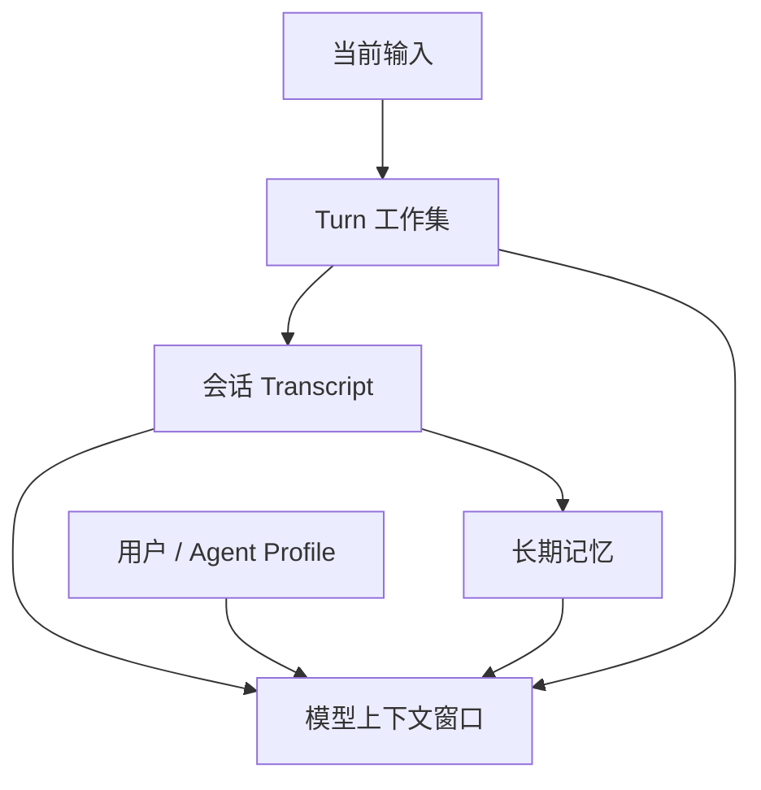

# 内存与状态模型

本文同时讨论 RAM 所有权和 Agent 的持久记忆。二者名字相似，但设计问题不同：前者决定对象如何安全生存和释放，后者决定哪些信息跨 Turn 或重启保留。

## RAM 所有权

优先使用单一 owner 和借用关系：

- `AgentSystem` 拥有全局运行时资源；
- Session actor 拥有会话可变状态；
- Turn 临时对象在 Turn 结束后释放；
- 只有真正跨任务共享且需要共同所有权的数据才使用 `Arc`；
- 可变共享状态优先通过消息传递，而不是扩大锁的作用域；
- 大 payload 尽量移动所有权或使用切片，避免多层复制。

设备侧尤其要避免：无界 `Vec`、无界 channel、完整复制长对话、在多个层级缓存同一响应。

## 跨 C ABI 的所有权

C ABI 使用不透明句柄隐藏 Rust 内部布局。基本规则是：

| 对象 | 创建方 | 使用方 | 释放方 |
| --- | --- | --- | --- |
| AgentSystem 句柄 | `claw-cabi` | C 集成层 | 对应 destroy/free API |
| Session 句柄 | `claw-cabi` | C 集成层 | 对应 close/free API |
| 输入字符串/字节 | C 调用方 | ABI 调用期间借用 | C 调用方 |
| 输出事件 | `claw-cabi` | C 调用方 | `claw_agent_event_free`，恰好一次 |

FFI 函数必须先校验空指针、长度、枚举值和 UTF-8，再构造安全 Rust 类型。Rust panic 不得穿过 C ABI；错误通过稳定返回码或事件传递。

更具体的函数与生命周期见 [C API](../api/c-api.md)。

## Agent 记忆层次

- **Turn 工作集**：当前请求、流式增量、工具调用和临时结果；Turn 后应尽快释放；
- **Transcript**：按会话组织的对话事实，可用于恢复和构建后续上下文；
- **Profile**：相对稳定的用户或 Agent 属性，不应被任意模型输出直接覆盖；
- **长期记忆**：经过筛选、提炼或显式写入的信息，不等于完整 Transcript；
- **模型上下文**：为一次请求构造的有界视图，不是持久化数据源。

`claw-context` 决定本次请求看见什么，`claw-memory` 管理记忆的领域结构，`claw-persistence` 负责把拥有者提供的状态可靠保存。三者不能混为一层。

## 持久化所有权

每种持久状态由定义 schema 的 crate 拥有。这意味着 owner 负责：

- schema 和版本号；
- 默认值与合法性校验；
- 从旧版本迁移；
- 何时标记 dirty；
- 何时生成一致快照；
- 如何区分“不存在”“损坏”“版本不支持”和“I/O 失败”。

持久化适配器只负责字节的可靠读写，不应猜测领域默认值。

## 提交与恢复

推荐的状态提交过程：

1. owner 在内存中完成一次合法状态变化；
2. 生成带 schema version 的快照；
3. 编码到临时记录或新槽位；
4. 校验完整性；
5. 原子地切换当前版本或提交标记；
6. 成功后清除 dirty generation。

恢复时，数据损坏不能静默替换为空状态，否则会把真实故障表现成用户数据丢失。允许恢复旧副本时，应记录降级原因并保留可诊断信息。

详见 [ADR-0005](../adr/0005-typed-persistence.md)。

## 什么不应持久化

除非有明确需求，不持久化：

- 原始 API key、临时 token 和审批凭证；
- 正在执行的 future、锁、文件描述符和裸指针；
- 可从配置或能力目录重新构建的缓存；
- 未完成 Turn 的任意中间对象；
- 未经过滤的调试日志或完整网络响应。

## 资源预算

新增状态时应给出预算和上限：

- 单消息、单 Turn 和单会话最大字节数；
- Transcript 保留/压缩策略；
- 同时打开会话数；
- 持久化写入频率与 Flash 磨损；
- 编码时的峰值额外内存；
- 失败重试是否会复制 payload。

无法给出精确值时，也应在设计和测试中建立明确的有界行为。

