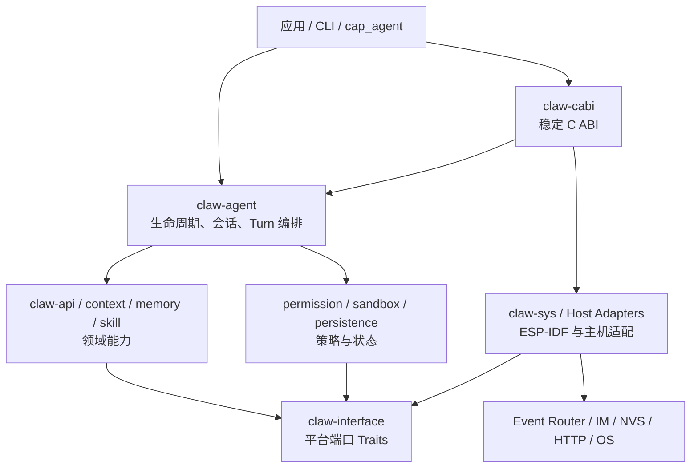

# 架构总览

本文描述 `agent-framework` 中相对稳定的模块边界与依赖方向。它不是源码目录的逐项翻译；具体接口以代码和 [API 文档](../api/README.md) 为准。

## 设计目标

框架需要同时满足以下约束：

- Agent 核心逻辑可在主机和 ESP-IDF 设备上复用；
- 设备侧继续兼容既有 C 组件、Event Router、IM 和 Capability 体系；
- 网络、存储、时间、日志等平台能力可替换、可测试；
- 单个会话可以连续处理多轮输入、工具调用和中断；
- RAM、Flash、线程数与二进制体积保持可控；
- 跨 FFI 和持久化边界的数据必须可验证、可演进。

## 分层结构



主机程序可以直接调用 Rust API；ESP-IDF 组件通常通过 `claw-cabi` 调用。领域层不直接依赖 ESP-IDF，而是依赖 `claw-interface` 定义的端口，再由设备或主机适配器提供实现。

## 模块职责

| 模块 | 负责 | 不负责 |
| --- | --- | --- |
| `claw-agent` | Agent 生命周期、会话注册表、Turn、工具循环、事件输出 | ESP-IDF 具体 API、业务 UI |
| `claw-api` | LLM 请求模型、客户端行为、流式响应、重试与错误分类 | 会话持久化、平台网络实现 |
| `claw-context` | 将系统提示、历史、技能和记忆组装为模型上下文 | 保存全部历史、执行工具 |
| `claw-memory` | Transcript、Profile、长期记忆的领域模型与操作 | 决定设备存储介质 |
| `claw-skill` | 技能目录、元数据、按需加载上下文 | 自动信任或执行任意技能内容 |
| `claw-permission` | 工具授权策略和审批结果 | OS 级隔离 |
| `claw-sandbox` | 路径和资源访问范围校验 | 替代完整安全审计 |
| `claw-persistence` | 类型化状态、版本、脏标记和提交协议 | 吞掉损坏或迁移错误 |
| `claw-interface` | 网络、存储、时钟等平台端口 | 平台实现 |
| `claw-sys` | ESP-IDF/C 系统适配与低层资源管理 | Agent 领域策略 |
| `claw-cabi` | C 可调用入口、句柄和事件所有权 | 在 ABI 内复制完整业务逻辑 |
| `claw-cli` | 主机调试入口和交互式命令 | 设备生产 UI |

## 允许的依赖方向

依赖应从编排层流向领域抽象，再流向平台端口。平台实现可以实现端口，但领域 crate 不应反向导入 `claw-sys`。

```text
application
    -> orchestration
        -> domain / policy
            -> interface traits
                <- platform adapters
```

需要跨层通信时，优先使用：

1. 类型化请求与返回值；
2. 明确生命周期的事件流；
3. 小而稳定的 trait；
4. 只在兼容边界使用 C ABI。

避免用全局变量、隐式单例或平台回调直接穿透多层模块。

## 关键不变量

- 每个公开句柄只有一个明确的释放责任方；
- C ABI 返回的事件由调用方恰好释放一次；
- `TurnEnded` 只表示当前 Turn 结束，`Closed` 才表示会话事件流终止；
- 持久状态由定义其 schema 的模块拥有，读取失败不能静默回退成空状态；
- 权限策略决定“是否允许”，沙箱决定“允许后可访问哪里”，二者不能互相替代；
- 异步代码不跨 `.await` 持有阻塞锁；
- `unsafe` 集中在可审计的 FFI/系统边界，并在进入安全 Rust 前完成指针、长度和 UTF-8 校验；
- 中断和取消是协作式控制流，调用者仍需继续消费事件，直到看到清晰的状态边界。

## 为什么不是全量重写

设备工程已经拥有成熟的启动流程、Event Router、IM、Capability 与 ESP-IDF 组件。迁移的重点是把 Agent 运行时、会话状态和策略收敛到 Rust，而不是一次性替换所有平台设施。单一 C ABI 使两侧可以独立演进，也降低了一次迁移造成的集成风险。

相关决策见：

- [ADR-0001：Rust 运行时与单一 C ABI](../adr/0001-rust-runtime-c-abi.md)
- [ADR-0002：注入式平台边界](../adr/0002-injected-platform-boundaries.md)
- [ADR-0003：会话事件流](../adr/0003-session-event-stream.md)

## 继续阅读

- [数据流](data-flow.md)
- [并发模型](concurrency-model.md)
- [内存模型](memory-model.md)
- [安全模型](security-model.md)
- [代码结构](../development/code-structure.md)

