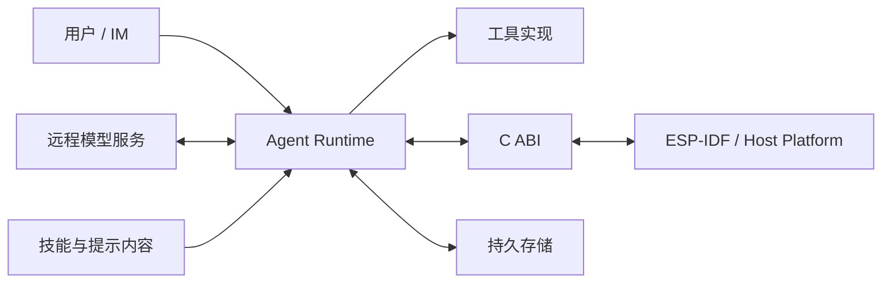

# 安全模型

本框架提供若干安全边界和策略挂点，但不应被视为已经完成独立安全认证的隔离环境。部署方仍需评估固件、网络、工具和凭据的整体威胁模型。

## 信任边界

用户输入、模型输出、技能文本、工具参数、网络响应和持久化字节都应被视为不可信数据。它们必须在进入相应领域类型时验证。

## 权限与沙箱

权限和沙箱解决不同问题：

- `claw-permission` 判断某个工具调用是否允许、需要询问或拒绝；
- `claw-sandbox` 限制允许调用可访问的路径、根目录或资源范围；
- 工具实现负责参数语义校验和实际副作用；
- 平台仍需提供 OS、文件系统或固件级的最小权限。

只通过权限策略并不意味着参数安全；只限制路径也不意味着操作已经获得用户授权。

权限等级的使用方法见 [用户指南](../user-guide.md)。

## 模型与工具边界

模型输出不能直接变成平台调用。工具执行前至少需要：

1. 按已注册 schema 解析工具名和参数；
2. 拒绝未知字段、非法类型和超出范围的值；
3. 应用权限策略；
4. 应用沙箱和资源预算；
5. 记录可审计的调用结果；
6. 将错误作为结构化工具结果返回，而不是伪造成功。

技能文件是上下文和元数据来源，不应因为位于技能目录就获得代码执行权限。

## 凭据

- API key 通过运行时配置或受控设备配置提供，不写入仓库；
- 日志、事件 tape、崩溃报告和测试 fixture 不应包含完整密钥；
- base URL 是信任决策的一部分，改变它可能把凭据发送到另一服务；
- 调试输出需要对 `Authorization`、token、Cookie 和用户隐私字段脱敏；
- 设备生产环境应使用平台提供的安全存储和传输能力。

当前主机 CLI 的环境变量见 [配置说明](../configuration.md)。

## C ABI 与 `unsafe`

`unsafe` 只允许存在于需要与 C/ESP-IDF 交互的窄边界。每个入口应验证：

- 指针是否为空、是否满足对齐与生命周期要求；
- 长度是否溢出、是否与缓冲区一致；
- 字符串是否为合法 UTF-8，或明确按字节处理；
- 整数到枚举的转换是否有效；
- 回调和用户数据是否在约定期间保持有效；
- panic 是否被阻止在 ABI 边界内传播；
- 所有权移交和释放函数是否成对。

安全 Rust 层不应继续携带未经验证的裸指针。

## 网络边界

网络通过注入端口实现，便于设备和主机使用不同 adapter，也便于测试错误路径。但可替换不等于天然安全：

- 生产环境应校验证书和目标主机；
- 重定向、代理和自定义 base URL 必须有明确策略；
- 响应大小、超时、重试次数和并发数必须有上限；
- 不把服务端错误正文原样写入包含用户隐私的日志；
- 重试非幂等工具或请求前，需要确认不会重复副作用。

## 持久化边界

持久化数据可能因掉电、版本变化或篡改而损坏。读取时应校验 schema version、长度、编码和完整性。错误必须分类并可诊断，不得把损坏解释为首次启动。

如果数据需要保密性或防篡改，部署方还必须在适配器或平台层加入加密、认证和密钥管理；类型化持久化本身不提供这些属性。

## 日志与诊断

`prod_logging`、`rich_logging` 和 cache profile 影响日志丰富度和产物形态。丰富日志适合调试，但可能增加二进制体积并暴露更多上下文。发布前应检查：

- 是否打印请求正文、工具参数或用户消息；
- 是否包含凭据、设备标识或路径；
- 错误链是否泄漏底层服务细节；
- 事件 tape 是否需要访问控制和过期策略。

## 已知限制

- 工具权限是应用层策略，不等同于强 OS 沙箱；
- 来自模型和技能的提示注入风险不能只靠 prompt 消除；
- 自定义工具的安全性取决于其实现和部署权限；
- 自定义模型端点会改变数据和凭据的信任边界；
- 内存安全不能代替业务授权、供应链验证和设备安全启动。

发现安全问题时，不要先公开可利用细节；请按仓库维护方提供的私下渠道报告。如果仓库尚未配置专用安全渠道，先联系维护者确认接收方式。

