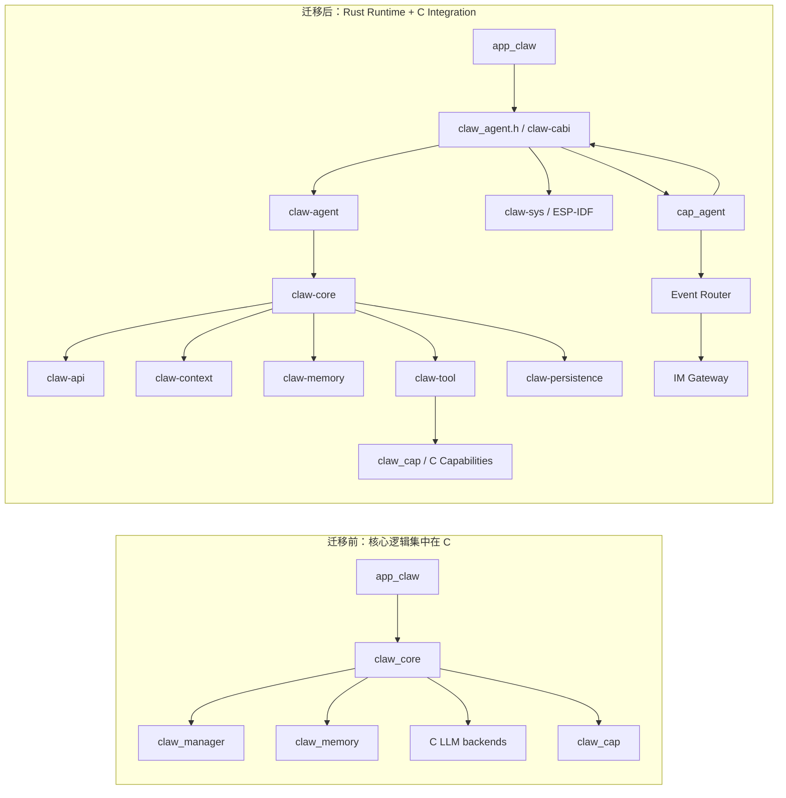

# `rust-migration` 分支迁移总结

> 文档生成日期：2026-08-07  
> 对比基线：`origin/master` @ `9ba07d013329df480e34a1a59d1513ab783d8a52`  
> 分支版本：`rust-migration` @ `0d04b9253c8933a3b9906e40d2693f826c92146c`  
> 统计口径：`git diff origin/master...rust-migration`，仅包含已提交内容

## 1. 总结

`rust-migration` 完成的不是一次局部语言替换，而是 Agent Runtime 的边界重建：原先位于 ESP-IDF C 组件中的 Agent loop、Session、LLM、Memory 和编排逻辑，被拆分为可在 Host 与 ESP-IDF 上复用、测试和组合的 Rust workspace；现有 C Capabilities、Event Router、IM Gateway、Lua 与板级组件继续保留，并通过一层明确的 C ABI 与 Rust Runtime 协作。

迁移后的核心边界是：

- `claw-agent` 是 Rust 侧公开装配入口，拥有 AgentSystem、Sessions、工具、持久化和生命周期。
- `claw-cabi` 通过 [`claw_agent.h`](crates/claw-cabi/include/claw_agent.h) 暴露唯一的 C ABI。
- `cap_agent` 是 C 系统访问 Session API 的 RPC adapter，并负责把 Session event stream 转换为 Event Router 事件。
- 既有 C Capabilities 仍由 `claw_cap` 注册和执行；Rust 在启动时将允许 LLM 调用的 C Capability 投影为 Tool。
- 固件默认链接按芯片预编译并压缩的 Rust 静态库，普通固件构建不要求现场编译 Rust 源码。

这是一次破坏性迁移。旧 `claw_core`、`claw_manager` 及相关 manager Capability API 已删除，调用方需要迁移到 `claw_agent.h`、`cap_agent` 的 `method + args` RPC，以及新的 Session event stream。

## 2. 变更规模与范围

本分支相对远端基线共有 320 个提交，其中 315 个非合并提交、5 个合并提交。

| 指标 | 数量 |
| --- | ---: |
| 变更文件 | 714 |
| 新增文件 | 535 |
| 修改文件 | 99 |
| 删除文件 | 75 |
| 重命名文件 | 5 |
| 新增行 | 91,560 |
| 删除行 | 24,884 |
| `agent-framework/` 新增 | 79,962 行 / 480 文件 |
| 被移除的旧核心 C 模块 | 19,378 行 / 64 文件 |
| C/应用集成层变更 | `+3,485/-668` / 18 文件 |

主要目录分布如下：

| 目录 | 新增 | 删除 | 文件数 | 说明 |
| --- | ---: | ---: | ---: | --- |
| `agent-framework/crates` | 69,115 | 0 | 419 | Rust 生产 crates、测试和示例 |
| `agent-framework/bench` | 3,454 | 0 | 25 | 内存分析、轨迹录制和 replay 工具 |
| `agent-framework/snapshots` | 1,922 | 0 | 15 | Rust public API 快照 |
| `components/claw_modules` | 2,070 | 19,844 | 88 | 删除旧核心，同时调整 Router、Capability、IM 和公共工具 |
| `components/claw_capabilities` | 4,412 | 3,448 | 51 | 新增 `cap_agent`，移除旧 manager caps，适配现有能力 |
| `components/common` | 730 | 671 | 10 | `app_claw` 生命周期与配置接线 |
| `docs/src` | 543 | 499 | 21 | 中英文 Runtime、Router、IM、构建与数据流文档 |
| `.agents/design` | 1,964 | 0 | 11 | 新架构与领域边界设计记录 |

本统计使用远端跟踪分支作为基线。本地 `master` 停留在 `a5047266`，若直接与本地 `master` 对比，会把主干在 2026-06-08 之后已经合入的 UI、板级、Lua 和文档改动重复计入本迁移。

## 3. 总体架构变化



迁移保持了平台代码与业务逻辑的单向依赖：纯 Rust 领域 crates 依赖 `claw-interface` 中的抽象，不直接依赖 ESP-IDF；`claw-sys` 和 `claw-cabi` 承担平台与 FFI 边界；C 应用仍负责设备启动、Capability 注册、Event Router 和 IM 集成。

### 3.1 旧模块与新归属

| 迁移前 | 迁移后 | 变化 |
| --- | --- | --- |
| `components/claw_modules/claw_core` | `claw-core`、`claw-agent`、`claw-api`、`claw-context` | Agent loop、LLM、上下文、事件流和装配职责拆分 |
| `components/claw_modules/claw_manager` | `claw-core::session`、Agent manager、multiagent | Session、Agent 生命周期和并发控制进入 typed Rust domain |
| `components/claw_modules/claw_memory` | `claw-memory` + `claw-core` memory context providers | 存储与 LLM compaction/extraction 分离 |
| `cap_agent_mgr`、`cap_session_mgr` | `cap_agent` + `claw_agent_session_*` | 统一为 Session RPC 和长期事件流 |
| `cap_llm_config` | `claw_agent_link_api` + `app_claw_update_config` | API 配置按用途绑定，并在 turn boundary 生效 |
| `cap_skill_mgr` | Rust Skill tools + 过渡期 C Skill adapter | Skill catalog/activation 进入 Agent tool surface |
| C LLM backend 与 media pipeline | `claw-api` | OpenAI-compatible、Anthropic-compatible、流式输出、JSON 和图片推理统一 |
| 隐式全局文件系统/HTTP/线程依赖 | `claw-interface` traits | Host double 与 ESP-IDF backend 使用同一业务代码 |

`claw_cap`、C Capability 实现、Event Router 和 C Skill registry 并未全部改写成 Rust。它们通过明确 adapter 与新 Runtime 连接，这是本分支有意保留的迁移边界。

## 4. Rust workspace

工作区当前包含 16 个生产 crate，共约 58,000 行 Rust 源码。

| Crate | 职责 |
| --- | --- |
| `claw-agent` | 对外装配 `AgentSystem`，连接 tools、persistence 和 core runtime，是应用选择 feature 的上层边界 |
| `claw-core` | Agent 执行、Session actor、turn/iteration 驱动、multiagent、mode、context provider 与运行时 worker |
| `claw-api` | OpenAI/Anthropic 兼容 LLM API、结构化 JSON、图片推理、SSE、取消和 retry |
| `claw-interface` | `ClawFs`、`ClawHttp`、`StreamingHttp`、`ClawThread`、`ClawExecutor`、`ClawTimer` 等依赖注入接口与 Host doubles |
| `claw-sys` | ESP-IDF HTTP、Timer、Thread、Executor 与 log sink 实现 |
| `claw-cabi` | Rust Runtime 到 C 的 `staticlib`、ABI 类型转换、事件所有权和 C Capability Tool adapter |
| `claw-tool` | Tool/ToolGroup、Registry、ToolSet、发现、启停、调用、retry 和 detached execution |
| `claw-permission` | Tool action 的 `Allow` / `Ask` / `Deny` 判定与 grant 去重 |
| `claw-context` | 按 block 位置、版本和预算组装 LLM request context，并提供可选观测能力 |
| `claw-memory` | append-only transcript、profile documents、long-term facts 和 compactor seam |
| `claw-persistence` | typed singleton/collection、schema version、generation tracking 和 durable snapshot |
| `claw-skill` | 多根目录 Skill 扫描、catalog、模板变量、文档激活与缓存 |
| `claw-sandbox` | 将 Agent 文件访问约束到 `/sandbox`、`/shared`、`/system` 虚拟根 |
| `claw-log` | `log` sink、structured `tracing`、Chrome/Perfetto trace 导出和编译期日志级别 |
| `claw-utils` | typed ID 宏、UTF-8 安全截断、stream part、channel 与 cooperative task 工具 |
| `claw-cli` | Host 诊断 CLI、Session 控制、日志和本地端到端调试 |

此外，`c-legacy/skill` 是设备端过渡 adapter，用于复用已经初始化的 C `claw_skill` registry；它不代表迁移最终目标。

## 5. Runtime 行为变化

### 5.1 生命周期

C 侧生命周期统一为：

| API | 行为 |
| --- | --- |
| `claw_agent_init` | 构造 stopped AgentSystem、恢复持久化状态，并可选绑定 root LLM API |
| `claw_agent_link_api` | 分别为 root Agent、subagent、memory、compaction 绑定或替换 API |
| `claw_agent_start` | 激活 Tool registry 并开放 Session 操作，不重建 AgentSystem |
| `claw_agent_stop` | 停用工具，但保留 API bindings、Sessions、streams 和 runtime 状态 |
| `claw_agent_deinit` | 停止并释放整个 AgentSystem |

初始 LLM 四元组可以全部为空，从而先建立未绑定 Runtime，再动态调用 `claw_agent_link_api`。部分为空的配置会被拒绝。运行中的 API 替换在下一个 turn boundary 生效，不打断当前 turn。

### 5.2 Session、Turn 与 Iteration

Session 使用非零 `uint32_t` ID，并在创建时明确选择 `PERSISTENT` 或 `EPHEMERAL`。公开控制面包括 create、list、open、submit、respond、interrupt、cancel、close、delete 和 receive。

一个打开的 Session 持有长期事件流，可连续承载多个 turn：

```text
TurnStarted
  IterationStarted
    Reasoning(Delta)* -> Reasoning(End)
    Output(Delta)*    -> Output(End)
    ToolCall*         -> ToolCalls(End)
  IterationEnded
  ...下一次 LLM/tool iteration...
TurnEnded
```

主要语义如下：

- `submit` 把普通输入加入 Session FIFO，即使已有 turn 正在执行也可排队。
- `respond(request_id, text)` 恢复当前等待输入的 turn；缺失或过期 request ID 会失败。
- `interrupt` 是协作式中断当前前台 turn；`cancel` 同时终止前台和后台工作。
- `TurnEnded` 只结束当前 turn，`Closed` 才终止整个 Session stream。
- 每个 content stream 都显式发出 `End`，调用方不需要用下一个事件推断边界。
- Root Agent 的事件对外可见；Subagent 的内部 iteration 不直接暴露，detached completion 会作为 root input 合并或唤醒新的 turn。

### 5.3 Agent 执行与并发

Runtime 采用 Session actor + 单所有者 worker 的设计，避免把核心状态放入跨 await 的共享 mutex。Agent run、Tool run 与 detached completion 由 async stream、`FuturesUnordered`、`SelectAll`、oneshot 和 async-channel 驱动。

设备端仍是单 OS thread 上的 cooperative async 并发。网络与等待型 future 可以并行推进，但同步文件系统、持久化、上下文组装或 CPU 密集工作必须保持有界，否则会阻塞同一执行线程。

### 5.4 Tools、权限与 Skill

Tool Runtime 从旧的“Core 直接调用 Capability”改为独立 registry：

- C capabilities 通过 `claw_cap` descriptor 注册为 Rust `ToolGroup`。
- Registry 管理全局启停；每个 Agent 的 `ToolSet` 管理可见性和临时加载状态。
- 默认只暴露小型核心 surface，其他 group 可通过 `tool_search` 查询，再用 `tool_load` 临时载入 schema。
- Tool 可同步、异步或 detached 执行，并具有 typed output、retry budget 和完成 handle。
- Permission policy 根据 action、resource 和 risk class 返回 `Allow`、`Ask` 或 `Deny`。
- `Ask` 产生语义化 `InputRequested`，由调用方决定显示为 IM 文本、按钮或对话框。
- `agent` Capability 不带 `CLAW_CAP_FLAG_CALLABLE_BY_LLM`，避免模型递归调用自身。

Skill registry 支持按优先级扫描多个根目录。设备装配时 DATA skills root 先于 SYSTEM root，因此同 ID 的用户 Skill 可以覆盖固件内置 Skill。

### 5.5 Context 与 Memory

Context 不再由一个大型 C 函数拼接，而是由 provider 生成 `Block`，再由 `claw-context` 统一处理位置、变化检测、渲染和预算。

Memory 被拆成三个持久化事实源：

- `TranscriptStore`：完整、append-only 的逐 turn 会话记录，是“说过什么”的事实源。
- `ProfileStore`：`soul.md`、`identity.md`、`user.md` 等可编辑画像文档。
- `LongTermMemory`：长期事实及增删改查。

Transcript storage 本身不做 LLM compaction。Compaction 是 LLM request context 的行为，由 `claw-core` 中的 context provider 通过 `Compactor` seam 驱动。这样持久化原文不会因为上下文窗口压缩而丢失。

### 5.6 持久化与恢复

`claw-persistence` 提供 typed singleton/collection，并将 schema version 与 state bytes 分开保存。Runtime object 持有自己的 `DurableState<T>`；修改会推进 generation，统一 persistence boundary 只写入 dirty snapshot。

持久化覆盖 ID allocators、Tool registry overrides、persistent Sessions 和 Agent recovery state。Transcript 以 completed turn 追加，状态快照使用原子替换。运行中的 future、waker、inbox、OS handle、Subagent runtime 和临时 Tool visibility 不序列化。

损坏或 schema 不匹配的状态必须显式报错或回退到更早的有效 checkpoint；不能静默当作冷启动。

### 5.7 Multiagent、Mode 与 Reasoning Effort

`multiagent` feature 编译 Session-scoped 的父子图、spawn/followup/interrupt/delete/watch/run 等 tools。图策略属于 multiagent domain，物理 Agent 操作由 Session actor 执行，两者通过 typed command/effect 边界连接。

Mode policy、当前 active mode 与 reasoning effort 被拆开。Plan mode、普通模式和恢复提示由 context provider 注入，而不是在 iteration loop 内散落条件分支。固件已移除固定 reasoning 字节上限；是否发送 reasoning 及 provider token/cache usage 由 runtime 配置和 feature 决定。

## 6. LLM 与 HTTP 层

`claw-api` 把原 C Core 中的 provider 与 transport 拆为可复用 crate：

- 统一 OpenAI-compatible 与 Anthropic-compatible request/response 模型。
- 同时提供 blocking 和 async client。
- 支持普通 chat、typed JSON output、Tool calls 和图片推理。
- Streaming API 输出 reasoning、content 和完整 Tool Call 的有序事件。
- Retry policy 按调用配置；网络错误、408、429、5xx 可重试，abort、无效请求和其他 4xx 不重试。
- Cancel token 覆盖 request send、headers 和 body read；drop stream 会取消 body transfer。

网络实现通过 `ClawHttp` / `StreamingHttp` 注入。设备端 `claw-sys` 使用持久 `esp_http_client` handle，Host 测试可注入 scripted mock 或真实 HTTP backend。

分支末尾额外完成了 ESP-IDF v6.1 HTTP ABI 适配、stream event 处理、body drain、公平 poll/yield 和 SSE time-slice starvation 修复，并为不完整 provider stream 增加诊断日志。

## 7. C ABI、Capability 与 Event Router

### 7.1 ABI 所有权

[`claw_agent.h`](crates/claw-cabi/include/claw_agent.h) 使用 tagged union 表示 Session event。调用方只能读取 `kind` 对应的 union member；成功 receive 的每个事件，无论是否使用，都必须且只能调用一次 `claw_agent_event_free`。

ABI 使用 `esp_err_t` 表达边界错误：

- `ESP_ERR_INVALID_ARG`：ID、UTF-8、配置或参数非法。
- `ESP_ERR_INVALID_STATE`：生命周期错误、Session 未正确打开或 input request 已过期。
- `ESP_ERR_NOT_FOUND`：Session 不存在。
- `ESP_ERR_TIMEOUT`：bounded receive 在时限内没有事件。

`cache_profile` 会增加 `USAGE` event，因此它会改变 C event ABI；生成静态库和编译 C 调用方时必须保持 feature 一致。

### 7.2 `cap_agent` RPC

同步请求统一为：

```json
{"method":"session.input","args":{"text":"hello"}}
```

`cap_agent` 支持 `session.create/open/list/submit/respond/input/interrupt/cancel/close/delete/command`。其中 `session.input` 是 IM/Event Router 的标准入口：存在 `request_id` 时走 `respond`，否则先 interrupt 当前 turn，再 submit 新输入。

`cap_agent` 为每个打开的 Session 建立唯一 event pump，并把 `claw_agent_event_t` 映射为 `claw_event_t`：

- output delta 在 pump 内聚合，`OUTPUT_END` 时只向 Router 发布一条完整消息。
- reasoning 不进入 Router 队列。
- Tool Call、turn boundary、input request、usage、error 和 closed 以结构事件发布。
- Session、request、channel、chat 和 correlation context 随事件传递。
- 每个成功提交的 user input 都有独立 pending route，按 FIFO 与后续 user turn 对齐。

当前固件资源上限为 32 个同时附加的 Session pump、每 Session 32 条 pending route、每 pump 32 KiB output buffer；每个 pump 使用一个 8192-byte FreeRTOS task stack。

### 7.3 `app_claw` 装配

`app_claw` 继续拥有设备级启动和停止顺序，但 Agent 内部不再由 C 复制实现。它现在负责：

1. 初始化存储路径、Event Router、C Capabilities 和 Skill registry。
2. 从 C Capability registry 构造 Rust Tool groups。
3. 调用 `claw_agent_init`，传入 persistence root、DATA/SYSTEM Skill roots 和可选 API config。
4. 注册并启动 system-only `cap_agent`。
5. 调用 `claw_agent_start` 开放 Session 操作。
6. 在配置更新时调用 `claw_agent_link_api`，而不是重建 Runtime。
7. 停止时按 ownership 顺序停止 event pumps、tools、Runtime 和 C components。

Event Router 仍负责规则匹配，IM Gateway 仍按 `channel + chat_id` 选择平台 backend。新的 Runtime 只输出语义事件，不直接知道 QQ、飞书、Telegram、微信或 Web 的发送实现。

## 8. 构建、目标与发布

### 8.1 ESP-IDF 版本约束

当前 Framework 只支持 ESP-IDF v6.1.x，已验证 checkout 为 `release/v6.1` @ `3e24f276fa9be527762c0c0891ad3fbb00029f06`。构建会校验 IDF 版本和 `esp_http_client_config_t` ABI fingerprint；不兼容的 header 会在构建期失败，而不是在设备运行时产生错位 FFI。

CI 固件镜像已迁移到 `espressif/idf:v6.1-beta1`，旧的本地 `esp_idf_patch.cmake` 被删除。分支还包含 v6.1 stream event、timer teardown、libc target 和多芯片构建修复。

### 8.2 支持目标

预编译 archive 覆盖：

- `esp32s3`
- `esp32c5`
- `esp32p4`
- `esp32s31`

`cmake/ClawRustTarget.cmake` 同时解析 Rust target triple 与 ESP-IDF libc archive 名称，避免在多芯片目标间硬编码。

### 8.3 预编译静态库

`build-idf-staticlib.sh` 将完整 Rust Runtime 编译为每目标 `libclaw_cabi.a`，再以 zstd 压缩到：

```text
crates/claw-cabi/prebuilt/<idf-target>/libclaw_cabi.a.zst
```

这些 archive 随仓库提交。正常 ESP-IDF build 只需 `zstd` 解压并链接匹配目标的 archive，不需要 Rust toolchain。修改 Rust 源码时，可运行：

```bash
./build-idf-staticlib.sh
```

CI 使用以下命令校验 committed archive 与源码一致，且不会覆盖仓库文件：

```bash
./build-idf-staticlib.sh --check
```

如需开发期直接从 Rust 源码构建，可将 `CLAW_RUST_PREBUILT_DIR` 配置为空。

Release profile 使用 `panic = "abort"`、`opt-level = "z"`、`codegen-units = 1`。LTO 有意关闭，因为 ESP-IDF GCC linker 不能直接消费 Rust archive 中的 LLVM bitcode。固件 size 还通过日志裁剪、预编译库压缩和 Runtime feature 选择继续控制。

### 8.4 日志 feature

`claw-cabi` 提供两种互斥的固件日志形态：

- `prod_logging`：保留轻量 `log`，编译掉 structured tracing。
- `rich_logging`：启用 structured tracing，编译掉重复 plain log，并自动带上 cache profiling。

当前普通固件 CMake 选择 `prod_logging`。`CLAW_DEBUG=1` 用于构建 rich logging archive。

## 9. 可观测性与开发工具

迁移新增了从 Runtime 到分析工具的完整观测链：

- `claw-log` 输出扁平 trace，可转换为 Chrome/Perfetto trace。
- Session、Agent、Tool、subagent 和 async logical task 使用独立 trace identity。
- `cache_profile` 记录 provider input/output/cache token usage 和 cache hit rate。
- `claw-context` 可选 intrusive observer 暴露 context snapshot。
- `claw-cli` 提供 host chat、persistent/ephemeral Session、append、interrupt、cancel、permission reply 和 trace 调试。
- `bench/claw-agent-profile` 与 `bench/claw-profile` 提供内存 workload。
- `bench/llm-tape` 可录制 Agent trajectory、保存 tape，并在不调用真实模型的情况下 replay。

Python 工具统一进入根 uv workspace，共享 `uv.lock` 和 `.venv`。

## 10. 测试与质量门禁

工作区包含 230 个 Rust 源文件，代码中约有 419 个 Rust test 入口标记，并另外提供 ESP-IDF 设备自测工程。重点覆盖：

- Agent loop、backend failure、Tool loop、detached Tool 和异步控制矩阵。
- Session 生命周期、并发 Session、FIFO、interrupt/cancel/respond 和持久化恢复。
- Multiagent spawn/followup/interrupt/join/delete/watch 与后台完成。
- Transcript、Profile、Long-term memory、compaction 和 persistence failure。
- OpenAI/Anthropic chat、media、SSE、retry、cache usage 和真实/模拟 HTTP。
- Tool registry、Skill registry、Permission、Sandbox、Context 和 trace。
- `claw-sys`、`claw-api` 的 ESP-IDF 集成测试。

质量门禁分为三层：

1. `check.sh`：`cargo check --workspace --all-targets`，并比对 15 个公开 crate 的 `cargo-public-api` 快照。
2. `harness.sh`：`fmt`、`clippy -D warnings`、`check`、`test`，覆盖 workspace、各 crate all-features、`claw-cabi` 日志/cache feature matrix 和 `claw-log` level matrix。
3. CI `pre_check_agent_framework`：安装 stable/nightly/Espressif toolchain，运行 `check.sh`、prebuilt archive 校验和完整 harness。

核心 crates 使用 typed error enums 与 `thiserror`，避免在 production path 中用 `Result<_, String>` 丢失错误来源。多数纯 Rust crates `forbid(unsafe_code)`；必要的 FFI/ESP-IDF unsafe 集中在 `claw-cabi` 和 `claw-sys` 边界。

## 11. 同步完成的配套改动

除 Rust workspace 本身外，分支还包含下列必要配套改动：

### 11.1 Capability 与 IM

- 新增 `cap_agent` 及完整 Event Router 协议。
- 删除 `cap_agent_mgr`、`cap_session_mgr`、`cap_skill_mgr`、`cap_llm_config`。
- `cap_llm_inspect` 拆分 provider、HTTP、media 和 runtime 实现，并复用新的 `claw-api`。
- `claw_cap` 增加 Tool descriptor state、group、可见性和调用上下文桥接。
- 新增 `claw_im_gateway` 与 `claw_im_session`，统一平台发送和 Session route。
- QQ、飞书、Telegram、微信和本地 IM adapter 迁移到统一上下文与发送路径。
- Scheduler、Router、Lua、System、Files、HTTP Request 和 Web Search 调整 component dependency 与调用约定。

### 11.2 公共 C 基础设施

- `claw_paths` 与 `claw_task` 从旧 Core 移到 `claw_utils`，供非 Agent C 组件继续使用。
- Event Router event 结构补充 Session、request、target 和 correlation 字段。
- `app_claw` Kconfig、Capability 列表、CLI 和 storage path 配置切换到新 Runtime。

### 11.3 IDF 与板级兼容

- 固件与 MCP server 示例迁移到 ESP-IDF v6.1 build flow。
- 调整部分 S3/P4/S31 板卡配置和 component dependency。
- 纳入 GC9107 与 GC9D01 LCD driver，保证相关板卡在新 IDF 依赖图下构建。
- Lua audio/thread 测试补充显式 component manifest；LCD、LVGL、IR、storage 依赖适配新的 build graph。

### 11.4 文档与设计记录

- 新增 AgentSystem、adapter、channel、persistence、SSE、Tool、Tool Search、Skill、Capability 和 orchestrator worker 设计文档。
- 中英文同步更新 Agent Runtime、Event Router、IM、LLM Inspect、Scheduler、构建、启动和数据流页面。
- public API snapshots 和 crate README 记录新的稳定边界。

## 12. 破坏性变化与迁移清单

合入或移植此分支时，调用方需要逐项确认：

- [ ] 不再包含或调用 `claw_core.h`、`claw_agent_mgr.h`、`claw_session_mgr.h`。
- [ ] C 应用改用 `claw_agent_init/start/stop/deinit` 管理 Runtime。
- [ ] LLM 配置改用 `claw_agent_link_api`，并为 root、subagent、memory、compaction 选择正确 purpose。
- [ ] Session ID 使用非零 numeric ID，并明确 persistent/ephemeral。
- [ ] `submit` 与 `respond` 不混用；权限/澄清回复携带最新 `request_id`。
- [ ] 一个 Session stream 只有一个生产 consumer；收到的 event 全部 exactly-once free。
- [ ] Event Router 调用 `cap="agent"` 与 `method + args`，不保留旧嵌套请求或 Agent 专用 action。
- [ ] Router/IM 保留 route 和 correlation context，长回复不逐 token 入队。
- [ ] C Capability descriptor 正确声明 group、LLM callable 和 lifecycle state。
- [ ] DATA/SYSTEM Skill roots 顺序正确，用户 Skill 覆盖内置 Skill。
- [ ] 构建环境使用受支持的 ESP-IDF v6.1.x，并安装 `zstd`。
- [ ] 目标芯片存在匹配的 committed `.a.zst`；Rust 改动后重新生成并执行 `--check`。
- [ ] `cache_profile` feature 与 C header/event consumer 保持一致。
- [ ] production 与 rich logging feature 不同时启用。
- [ ] 运行 Rust、文档和至少一个目标板固件验证。

## 13. 当前过渡边界与后续工作

迁移主体已经接线并进入 CI，但以下边界仍需明确维护：

1. **Skill 仍有 C legacy adapter。** `use_legacy_skill` 让 Rust Runtime 复用 C Skill singleton；完全移除该 adapter 需要先确定 C/Lua/固件 Skill 消费者的最终归属。
2. **Capabilities 仍主要在 C。** Rust Tool registry 管理其 Agent 投影，但具体硬件、Lua、IM、Router 等实现仍由 ESP-IDF C components 提供。
3. **FFI 与预编译 archive 必须同步。** `claw_agent.h`、`claw-cabi` feature 或 ESP-IDF ABI 变化后，四个目标 archive 都必须刷新。
4. **设备并发是 cooperative。** 单次 poll 内的同步重活仍可能造成 stream 饥饿；后续新增路径需要保持有界并显式 yield。
5. **部分 end-user 文档仍混有旧术语。** 例如 `docs/.../boot-and-runtime.mdx` 仍描述 `claw_core_init`、`claw_memory_init` 和旧 manager capabilities；`build-from-source.mdx` 对“默认预编译 archive 不需要 Rust toolchain”和“源码重建需要 Rust toolchain”的区分也需继续收敛。
6. **内部架构索引需要最终清理。** 根 `AGENTS.md` 与部分早期 design/roadmap 仍引用迁移前路径或已经演进的对象名，不能代替当前 public API、源码和测试作为最终事实源。

## 14. 推荐验证命令

在仓库根目录执行：

```bash
cd agent-framework
./check.sh
./harness.sh
./build-idf-staticlib.sh --check
```

验证中英文文档：

```bash
cd docs
pnpm run check:doc-lines
pnpm run build
```

验证固件集成，至少选择一个受影响的目标板：

```bash
cd application/edge_agent
idf.py bmgr -c ./boards -b esp32_S3_DevKitC_1
idf.py build
```

Rust 源码开发时如需绕过 committed archive：

```bash
idf.py -DCLAW_RUST_PREBUILT_DIR= build
```

## 15. 结论

`rust-migration` 已把 Agent Runtime 从 ESP-IDF C 单体重构为分层 Rust 系统，同时保留了现有硬件、Capability、Lua、Event Router 和 IM 生态。迁移的核心收益不是“Rust 代码更多”，而是：

- Agent、Session、Tool、Memory、Context、Permission 和 Persistence 拥有明确的领域所有权。
- Host 与设备共享同一业务实现，平台依赖可注入、可替换、可测试。
- C/Rust 边界收敛到一份有生命周期、错误和内存所有权约束的 ABI。
- Session event stream 统一了流式输出、权限回复、中断、后台任务和多 Agent 行为。
- public API snapshot、feature matrix、device self-test、trace 和 replay 形成可持续演进的质量闭环。

后续工作应围绕过渡 adapter 清理、文档术语收敛、设备性能与 ABI/archive 一致性展开，而不是重新把已拆开的领域职责聚合回单一 Core。
